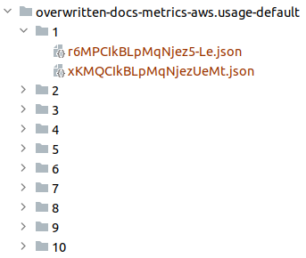
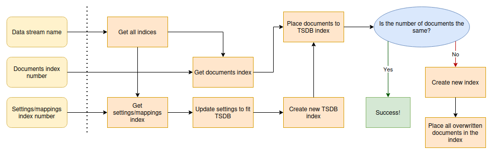
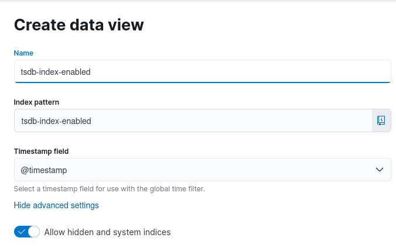
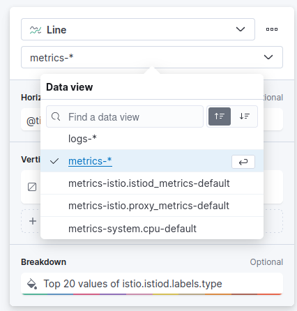

This repository contains the code to a new approach for testing
TSDB migration. In [Why is this important](#Why-is-this-important) you
get a better overview of what this is and why it is necessary.

# Table of Contents
1. [Installation](#Installation)
2. [Requirements](#Requirements)
3. [Set up](#Set-up)
4. [Run](#Run)
5. [Why is this important](#Why-is-this-important)
6. [Understanding the program](#Understanding-the-program)
7. [Realistic output example](#Realistic-output-example)
8. [Testing the dashboard](#Testing-the-dashboard)


## Installation

You need to install the [Python client for ElasticSearch](https://www.elastic.co/guide/en/elasticsearch/client/python-api/current/installation.html):
```console
python -m pip install elasticsearch
```


## Requirements

1. You need to be running ElasticSearch.
2. You need a data stream with at least one field set as dimension.


## Set up

You need to set the variables in the `main.py` file:

```python
# Variables to configure the ES client
elasticsearch_host = "https://localhost:9200"
elasticsearch_ca_path = "/home/c/.elastic-package/profiles/default/certs/elasticsearch/ca-cert.pem"
elasticsearch_user = "elastic"
elasticsearch_pwd = "changeme"

# If you are running on cloud, you should set these two. If they are not empty, then the client will connect
# to the cloud using these variables, instead of the above ones.
elastic_pwd = ""
cloud_id = ""
```

You can also change the defaults in the `main.py` for:
- The number of documents you want to copy from the TSDB disabled index. Just add
 the parameter `max_docs` to the `copy_from_data_stream` function, like this:
   ```python
   all_placed = copy_from_data_stream(client, data_stream, max_docs=5000)
   ```
- The index number from the data stream you want to use to retrieve the documents,
and the index number for the index you want to use for the settings and mappings:
   ```python
   copy_from_data_stream(client, data_stream, docs_index=0,settings_index=1)
   ```
  
   Confused by this? Imagine a data stream with two indexes:

   

   By default, the first index of the data stream is always used as the one
   that has the documents. The last index is the default for the settings/mappings.
   This way, if you changed the data stream to include one existent field as dimension,
   you will not have to restart sending the documents, and can just use the data
   that is already there.
- Do you want to get in a local directory some of the files that are being overwritten?
Set these variables:
    ```python
    # Name of the directory to place files
    directory_overlapping_files = "overwritten-docs"
    
    # Do you want to get in your @directory_overlapping_files the files that are overlapping?
    # Set this to True and delete the directory named directory_overlapping_files if it already exists!
    get_overlapping_files = False
    ```
  The directory should not exist! Otherwise, the files will not be placed, since we are
not deleting the directory. An warning will be shown indicating that the files
were not placed:
    ```commandline
    WARNING: The directory overwritten-docs exists. Please delete it. Documents will not be placed.
    ```
  In case they are placed, you will have in your project structure something
similar to this:

    
    And then you can just compare the files!


## Run

After settings the values for all the variables, just run the python program:

```python
python main.py
```

## Algorithm




The algorithm for the program is as follows:
1. Given the data stream name, we get all its indices.
2. Given the documents index number provided by the user, we obtain the index
name from the list we got on step 1.
3. Given the settings/mappings index number provided by the user,
we obtain the index name from the list we got on step 1.
4. We retrieve the mappings and settings from the index we got on step 3.
5. We update those same settings so TSDB is enabled.
6. We create a new index given the settings and mappings. This index has
TSDB enabled.
7. We place the documents in index obtained on step 2 on our
TSDB enabled new index.
8. We compare if the number of files placed in the TSDB index is the same
as the number of files we retrieved from the documents index.
9. If it is the same, the program ends.
10. Otherwise, we will place all updated documents in a new index.
11. The dimensions and timestamp of the documents in this new index
will be displayed in the output.


## Why is this important

Currently, the testing for TSDB migration is all done manually.
The steps for this testing process can be found in [this document](https://docs.google.com/document/d/1l-PCY9zHQ0TTyQuCSbf5qKUvxV7lpfMybY0APMJweRI/edit#heading=h.qrq8p339p7it).

There are a few drawbacks to this testing process:
1. If we receive documents in an inconsistent manner (like it happens with GCP integration) then we cannot see if we
lose information or not when TSDB is enabled.
2. If we receive lots of documents, it is very hard to find which ones were lost. We have to do that manually.
3. If we want to create situations that cause a conflict to check if TSDB is working correctly, we need to do it twice: one for TSDB disabled and one for TSDB enabled.
4. If waiting to test for an index for 1 hour for each mode, then we would have to do the exact same thing twice:
once for when TSDB is disabled, and once for when TSDB is enabled, each mode for 1 hour.


This makes the testing process very vulnerable (and tiring).

This approach tries to fix all those vulnerabilities in a way that the only thing
the tester needs to do is give as an input the `data_stream` name with TSDB disabled.
After that, the program will tell the tester if the dimensions set are enough or not.


## Understanding the program

Please refer to the [sample](sample/README.md) to understand the basics of it.

## Realistic output example

<details>
<summary>
In case TSDB migration was successful, ie, no loss of data occurred.
</summary>

```console
You're testing with version 8.8.0-SNAPSHOT.

Testing data stream metrics-aws.usage-default.
Index being used for the documents is .ds-metrics-aws.usage-default-2023.06.29-000001.
Index being used for the settings and mappings is .ds-metrics-aws.usage-default-2023.06.29-000001.

The time series fields for the TSDB index are: 
	- dimension (7 fields):
		- agent.id
		- aws.dimensions.Class
		- aws.dimensions.Resource
		- aws.dimensions.Service
		- aws.dimensions.Type
		- cloud.account.id
		- cloud.region
	- gauge (2 fields):
		- aws.usage.metrics.CallCount.sum
		- aws.usage.metrics.ResourceCount.sum
	- routing_path (7 fields):
		- agent.id
		- aws.dimensions.Class
		- aws.dimensions.Resource
		- aws.dimensions.Service
		- aws.dimensions.Type
		- cloud.account.id
		- cloud.region

Index tsdb-index-enabled successfully created.

Copying documents from .ds-metrics-aws.usage-default-2023.06.29-000001 to tsdb-index-enabled...
All 5000 documents taken from index .ds-metrics-aws.usage-default-2023.06.29-000001 were successfully placed to index tsdb-index-enabled.
```
</details>

<details>
<summary>
In case TSDB migration was not successful.
</summary>

```console
You're testing with version 8.8.0-SNAPSHOT.

Testing data stream metrics-aws.usage-default.
Index being used for the documents is .ds-metrics-aws.usage-default-2023.06.29-000001.
Index being used for the settings and mappings is .ds-metrics-aws.usage-default-2023.06.29-000001.

The time series fields for the TSDB index are: 
	- dimension (7 fields):
		- agent.id
		- aws.dimensions.Class
		- aws.dimensions.Resource
		- aws.dimensions.Service
		- aws.dimensions.Type
		- cloud.account.id
		- cloud.region
	- gauge (2 fields):
		- aws.usage.metrics.CallCount.sum
		- aws.usage.metrics.ResourceCount.sum
	- routing_path (7 fields):
		- agent.id
		- aws.dimensions.Class
		- aws.dimensions.Resource
		- aws.dimensions.Service
		- aws.dimensions.Type
		- cloud.account.id
		- cloud.region

Index tsdb-index-enabled successfully created.

Copying documents from .ds-metrics-aws.usage-default-2023.06.29-000001 to tsdb-index-enabled...
WARNING: Out of 10000 documents from the index .ds-metrics-aws.usage-default-2023.06.29-000001, 152 of them were discarded.

Overwritten documents will be placed in new index.
Index tsdb-overwritten-docs successfully created.

The timestamp and dimensions of the first 10 overwritten documents are:
- Timestamp 2023-06-29T13:24:00.000Z:
	agent.id: 178edbcb-2132-497d-b6da-e8c7d8095a90
	aws.dimensions.Class: None
	aws.dimensions.Resource: Spot
	aws.dimensions.Service: Fargate
	aws.dimensions.Type: Resource
	cloud.account.id: 627286350134
	cloud.region: eu-north-1
- Timestamp 2023-06-29T13:24:00.000Z:
	agent.id: 178edbcb-2132-497d-b6da-e8c7d8095a90
	aws.dimensions.Class: None
	aws.dimensions.Resource: Spot
	aws.dimensions.Service: Fargate
	aws.dimensions.Type: Resource
	cloud.account.id: 627286350134
	cloud.region: ap-southeast-1
- Timestamp 2023-06-29T13:24:00.000Z:
	agent.id: 178edbcb-2132-497d-b6da-e8c7d8095a90
	aws.dimensions.Class: None
	aws.dimensions.Resource: OnDemand
	aws.dimensions.Service: Fargate
	aws.dimensions.Type: Resource
	cloud.account.id: 627286350134
	cloud.region: us-east-2
- Timestamp 2023-06-29T13:24:00.000Z:
	agent.id: 178edbcb-2132-497d-b6da-e8c7d8095a90
	aws.dimensions.Class: None
	aws.dimensions.Resource: OnDemand
	aws.dimensions.Service: Fargate
	aws.dimensions.Type: Resource
	cloud.account.id: 627286350134
	cloud.region: eu-north-1
- Timestamp 2023-06-29T13:24:00.000Z:
	agent.id: 178edbcb-2132-497d-b6da-e8c7d8095a90
	aws.dimensions.Class: None
	aws.dimensions.Resource: OnDemand
	aws.dimensions.Service: Fargate
	aws.dimensions.Type: Resource
	cloud.account.id: 627286350134
	cloud.region: ap-southeast-1
- Timestamp 2023-06-29T13:24:00.000Z:
	agent.id: 178edbcb-2132-497d-b6da-e8c7d8095a90
	aws.dimensions.Class: None
	aws.dimensions.Resource: TableCount
	aws.dimensions.Service: DynamoDB
	aws.dimensions.Type: Resource
	cloud.account.id: 627286350134
	cloud.region: us-east-1
- Timestamp 2023-06-29T13:24:00.000Z:
	agent.id: 178edbcb-2132-497d-b6da-e8c7d8095a90
	aws.dimensions.Class: None
	aws.dimensions.Resource: ListMetrics
	aws.dimensions.Service: CloudWatch
	aws.dimensions.Type: API
	cloud.account.id: 627286350134
	cloud.region: eu-west-1
- Timestamp 2023-06-29T13:24:00.000Z:
	agent.id: 178edbcb-2132-497d-b6da-e8c7d8095a90
	aws.dimensions.Class: None
	aws.dimensions.Resource: ListMetrics
	aws.dimensions.Service: CloudWatch
	aws.dimensions.Type: API
	cloud.account.id: 627286350134
	cloud.region: eu-west-2
- Timestamp 2023-06-29T13:24:00.000Z:
	agent.id: 178edbcb-2132-497d-b6da-e8c7d8095a90
	aws.dimensions.Class: None
	aws.dimensions.Resource: ListMetrics
	aws.dimensions.Service: CloudWatch
	aws.dimensions.Type: API
	cloud.account.id: 627286350134
	cloud.region: eu-west-3
- Timestamp 2023-06-29T13:24:00.000Z:
	agent.id: 178edbcb-2132-497d-b6da-e8c7d8095a90
	aws.dimensions.Class: None
	aws.dimensions.Resource: ListMetrics
	aws.dimensions.Service: CloudWatch
	aws.dimensions.Type: API
	cloud.account.id: 627286350134
	cloud.region: sa-east-1
```

</details>


## Testing the dashboard

Are you sure you want to test a dashboard?...

Unfortunately, there is no automation for a dashboard.
You have a tiring and repetitive process in front of you:

1. Create a data view for the TSDB index:

  

> **Note**: The TSDB index will be deleted and recreated every time you
> run the program. It is also a hidden index, in case you are having
> trouble finding it.


2. Go to the dashboard you wish to text, and for every visualization
change the data view to the one you just created:

   