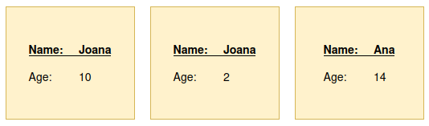

## Example data

There are three documents that will be used in this example:



The field `name` will be set as dimension for the TSDB index and `age` will be set as counter.
Since two of the documents are identified by the same dimension (`name: Joana`), only two
of the three documents will be part of the TSDB index. The document that was overwritten
will be copied to a new index.

### Important: Understanding overwritten documents

The number of documents placed in the index intended for them **might not** correspond
to the number of all files we lost!

Imagine that instead of having only two documents with `name: Joana`, like in the situation above,
we have four of them. This means that one file will be received and the `_tsid` will be generated.
After that, we receive the second one and the `_tsid` is the same. So the document is overwritten.
This would happen for the other two documents as well. So, **we started with 4 documents
and ended with just 1 overwritten document.**


## Algorithm

This is just an overview of the algorithm. You can find the detailed one
in [here](../README.md).

### Prepare the setup to test the example

```python
prepare_set_up(client, data_stream_name, sample_index_template_name, template_path)

place_documents(client, data_stream_name, documents_path)
```

Given a data stream name and the index template stored in the file `template_path`,
we create:
1. The index template with the file configuration.
2. A new data stream that matches the index pattern of the index template.
3. We place all the documents from the folder `sampleDocs` to the new data stream.

### Test example

The gist of this algorithm is to create a new TSDB index based on the standard
data stream and copy the documents from the standard index to the TSDB index. If
the number is the same then we know no loss of data occurred.

All this is being done when calling the function:

```python
copy_from_data_stream(client, data_stream_name)
```

After the document have been placed to the TSDB index, two things can happen:
1. A message similar to this one is displayed:
```console
Copying documents from .ds-metrics-docker.cpu-default-2023.06.08-000001 to tsdb-index-enabled...
All 980 documents taken from index .ds-metrics-docker.cpu-default-2023.06.08-000001 were successfully placed to index tsdb-index-enabled.
```
2. Or we receive a warning for loss of data (which is the case):
```console
Copying documents from .ds-test-tsdb-sample-2023.06.09-000001 to tsdb-index-enabled...
WARNING: Out of 3 documents from the index .ds-test-tsdb-sample-2023.06.09-000001, 1 of them was/were discarded.
```

Since losing data means that we have documents that were overwritten, we will
copy all of these to a new index. We need to do this because the field `_version`
is not searchable:

```python
print("Index for the overwritten documents will be created...")
create_index_missing_for_docs(client)
get_missing_docs_info(client)
```

The output of would be something as this:
```console
The timestamp and dimensions of the first 10 overwritten documents are:
- Timestamp 2099-11-15T13:12:00.000Z:
	name = Joana
```

## Example results

Running the `main.py` file will produce a result similar to this one:

```console
You're testing with version 8.8.0-SNAPSHOT.

Preparing the setup...
	Preparing index template test-tsdb-template-sample from file templates/index-template.json...
		Index template test-tsdb-template-sample exists and will be deleted, along with all its data streams.
	Preparing data stream test-tsdb-sample...
	Index template test-tsdb-template-sample successfully created.
	Data stream test-tsdb-sample successfully created.
Ready to start.

Placing documents on the index test-tsdb-sample...
Successfully placed 3 documents on the index test-tsdb-sample.

Using data stream test-tsdb-sample to create new TSDB index tsdb-index-enabled...
	The index .ds-test-tsdb-sample-2023.06.09-000001 will be used as the standard index.
Creating index tsdb-index-enabled...
	Index tsdb-index-enabled exists and will be deleted.
Index tsdb-index-enabled successfully created.

Copying documents from .ds-test-tsdb-sample-2023.06.09-000001 to tsdb-index-enabled...
WARNING: Out of 3 documents from the index .ds-test-tsdb-sample-2023.06.09-000001, 1 of them was/were discarded.

Index for the overwritten documents will be created...
Creating index tsdb-overwritten-docs...
	Index tsdb-overwritten-docs exists and will be deleted.
Index tsdb-overwritten-docs successfully created.

The timestamp and dimensions of the first 10 overwritten documents are:
- Timestamp 2099-11-15T13:12:00.000Z:
	name = Joana
```


